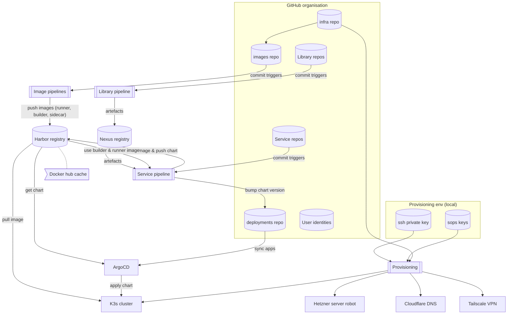

# GitOps with Argo CD

This repository serves as the GitOps source for Argo CD-based application delivery. It uses a monorepo structure with environment-specific configurations and shared resources. The setup uses a GitHub App to authenticate Argo CD to this repository.

## Overview



## Repository Layout

The repository follows a structured layout for infrastructure-as-code and GitOps application delivery:

```
infra/
├── envs/                          # Environment configurations
│   ├── shared/                    # Shared resources across environments
│   │   ├── apps/                  # Shared applications (e.g., Nexus)
│   │   │   └── nexus/            # Helm chart for Nexus
│   │   └── secrets.plain/         # Shared secrets (GitHub App credentials)
│   │       └── github-app-credentials.yaml
│   ├── cit/                       # CIT environment
│   │   ├── env.properties         # Environment variables (HOSTNAME, EXTERNAL_IP, etc.)
│   │   ├── apps/                  # Argo CD Application manifests
│   │   │   ├── traingen-app.yaml
│   │   │   └── petrinet-dialog-app.yaml
│   │   └── secrets.plain/         # Environment-specific secrets
│   │       └── github-oauth-credentials.yaml
│   ├── dev/                       # Dev environment (same structure as cit)
│   └── global/                    # Global environment
├── tools/                         # Provisioning and automation scripts
│   ├── k3s/                       # Kubernetes provisioning scripts
│   │   ├── identity.sh            # cert-manager + Dex SSO
│   │   ├── gitops.sh              # Argo CD provisioning
│   │   ├── registry.sh            # Harbor registry provisioning
│   │   ├── ci.sh                  # GitHub Actions Runner Controller
│   │   └── observability.sh       # Monitoring stack
│   └── provision-hetzner-baremetal.sh  # Bare metal server provisioning
├── templates/                     # Infrastructure templates
│   └── hetzner-bare/              # Hetzner bare metal templates
└── docs/                          # Documentation
    ├── GITOPS.md                  # This file
    ├── ONBOARDING.md              # Team onboarding guide
    └── autogenerated/             # Auto-generated docs

```

## Application Delivery Model

### Apps-of-Apps Pattern

The repository uses Argo CD's **Apps-of-Apps pattern** for declarative application management:

1. **Root Application**: Created per environment (e.g., `cit-root`, `dev-root`)
   - Watches `envs/<env-name>/apps/` directory
   - Auto-syncs all Application manifests in that directory
   - Enables GitOps: commit → automatic deployment

2. **Child Applications**: Individual app manifests in `envs/<env-name>/apps/`
   - Each YAML defines an Argo CD Application
   - Points to application source (Helm chart, Kustomize, plain manifests)
   - Specifies sync policy (automated vs manual)

### Example Application Manifest

```yaml
apiVersion: argoproj.io/v1alpha1
kind: Application
metadata:
  name: traingen
  namespace: argocd
spec:
  project: cit                    # Environment-specific AppProject
  source:
    repoURL: https://github.com/<org>/infra-envs.git
    targetRevision: HEAD
    path: envs/cit/apps/traingen  # Path to app manifests/chart
  destination:
    server: https://kubernetes.default.svc
    namespace: default
  syncPolicy:
    automated:
      prune: true                 # Delete resources removed from Git
      selfHeal: true              # Auto-sync on drift detection
    syncOptions:
      - CreateNamespace=true
```

### Directory Structure per Environment

Each environment follows this structure:

```
envs/<env-name>/
├── env.properties                # Environment configuration
│   ├── HOSTNAME=prod.example.com
│   ├── EXTERNAL_IP=203.0.113.10
│   ├── VLAN_IP=192.168.100.1
│   └── ACME_EMAIL=...
├── apps/                         # Argo CD Application manifests
│   ├── app1-app.yaml            # Application definition
│   ├── app2-app.yaml
│   └── app1/                    # Optional: app-specific manifests
│       ├── deployment.yaml
│       └── service.yaml
├── secrets.plain/                # Plain-text secrets (gitignored)
│   └── github-oauth-credentials.yaml
└── secrets.sops/                 # SOPS-encrypted secrets
    └── sensitive-data.yaml
```

## Provisioning Scripts

### 1. Identity & SSO (`identity.sh`)

**Purpose**: Foundation for authentication and TLS certificates

**Provisions**:
- **cert-manager**: Automated TLS certificate management via Let's Encrypt
- **Dex**: Standalone OIDC provider with GitHub OAuth integration
- **Shared secrets**: Dex client secrets for Argo CD, Harbor, Grafana

**Prerequisites**: None (runs first)

**Usage**:
```bash
tools/k3s/identity.sh <env-name>
```

**Key Features**:
- Auto-generates service hostnames from `HOSTNAME` in `env.properties`
- Creates DNS records via Cloudflare API (if configured)
- Generates random Dex client secrets for each service
- Stores secrets in `sso` namespace for cross-namespace access

**Phases**:
1. DNS Management (Cloudflare)
2. cert-manager installation
3. Dex deployment with GitHub OAuth
4. Dex client secrets generation
5. Validation

### 2. GitOps (`gitops.sh`)

**Purpose**: Argo CD deployment with SSO integration

**Provisions**:
- **Argo CD**: GitOps continuous delivery tool
- **OIDC integration**: Dex SSO for GitHub-based authentication
- **Repository credentials**: GitHub App for private repo access
- **AppProject**: Environment-specific project
- **Root Application**: Apps-of-Apps pattern entry point

**Prerequisites**: `identity.sh` must run first

**Usage**:
```bash
tools/k3s/argocd.sh <env-name>
```

**Key Features**:
- Disables embedded Dex (uses external Dex from `identity.sh`)
- Configures RBAC: GitHub org admins → Argo CD admin role
- Creates root application watching `envs/<env-name>/apps/`
- Auto-sync enabled for GitOps workflow

**Phases**:
1. DNS Management
2. GitHub credentials (App + OAuth)
3. Argo CD installation via Helm
4. Argo CD resources (AppProject, Repository, Root App)
5. Validation

**RBAC Configuration**:
```yaml
# GitHub org admins → full admin access
g, <github-org>:admins, role:admin

# All org members → read-only access
g, <github-org>:*, role:readonly
```

### 3. Registry (`registry.sh`)

**Purpose**: Harbor container registry with Docker Hub proxy

**Provisions**:
- **Harbor**: Enterprise container registry
- **OIDC integration**: Dex SSO for authentication
- **Docker Hub proxy**: Caching proxy for Docker Hub images
- **Robot account**: CI/CD credentials

**Prerequisites**: `identity.sh` must run first

**Usage**:
```bash
tools/k3s/harbor.sh <env-name>
```

**Key Features**:
- Configures Harbor with Dex OIDC
- Creates `dockerhub-proxy` project for caching
- Generates robot account for CI/CD pipelines
- Stores robot credentials in `harbor-robot-runner` secret

**Phases**:
1. DNS Management
2. Harbor installation via Helm
3. Harbor configuration (OIDC, proxy, robot account)
4. Validation

**Docker Hub Proxy Usage**:
```dockerfile
# Instead of: FROM nginx:latest
FROM harbor.prod.example.com/dockerhub-proxy/library/nginx:latest
```

### 4. CI/CD (`ci.sh`)

**Purpose**: Self-hosted GitHub Actions runners

**Provisions**:
- **Actions Runner Controller (ARC)**: Manages GitHub Actions runners
- **RunnerDeployment**: Scalable runner pool
- **GitHub App credentials**: Authentication for runner registration

**Prerequisites**: `cert-manager` must be installed

**Usage**:
```bash
tools/k3s/github-action-runner.sh <env-name>
```

**Key Features**:
- Uses GitHub App for authentication (not PAT)
- Creates runners with environment-specific labels
- Docker-in-Docker (DinD) enabled for container builds
- Auto-scales based on workflow demand

**Phases**:
1. Prerequisites validation
2. GitHub credentials
3. ARC installation
4. Runner deployment
5. Validation

**Runner Configuration**:
```yaml
spec:
  replicas: 2
  template:
    spec:
      organization: <github-org>
      labels:
        - self-hosted
        - linux
        - x64
        - <env-name>        # Environment-specific label
      dockerEnabled: true
```

**GitHub Actions Workflow Usage**:
```yaml
jobs:
  build:
    runs-on: [self-hosted, linux, cit]  # Use cit environment runners
```

## Provisioning Order

The scripts must be run in this order due to dependencies:

```
1. identity.sh      # Foundation: cert-manager + Dex SSO
   ↓
2. gitops.sh        # Argo CD (depends on Dex)
   ↓
3. registry.sh      # Harbor (depends on Dex)
   ↓
4. ci.sh            # GitHub Actions runners (depends on cert-manager)
   ↓
5. observability.sh # Monitoring stack (optional)
```

**Quick Provisioning**:
```bash
ENV_NAME=cit

# 1. Identity & SSO
tools/k3s/identity.sh $ENV_NAME

# 2. GitOps
tools/k3s/argocd.sh $ENV_NAME

# 3. Registry
tools/k3s/harbor.sh $ENV_NAME

# 4. CI/CD
tools/k3s/github-action-runner.sh $ENV_NAME
```

## Secret Management

### Secret Types

1. **Shared Secrets** (`envs/shared/secrets.plain/`)
   - GitHub App credentials (used by Argo CD, ARC)
   - Applied to multiple namespaces

2. **Environment Secrets** (`envs/<env-name>/secrets.plain/`)
   - GitHub OAuth credentials (Dex configuration)
   - Environment-specific credentials

3. **SOPS-Encrypted Secrets** (`envs/<env-name>/secrets.sops/`)
   - Sensitive data encrypted with SOPS
   - Decrypted during provisioning

### Secret Distribution

Provisioning scripts automatically distribute secrets to required namespaces:

```bash
# Example: GitHub App credentials applied to multiple namespaces
kubectl -n argocd apply -f envs/shared/secrets.plain/github-app-credentials.yaml
kubectl -n actions-runner-system apply -f envs/shared/secrets.plain/github-app-credentials.yaml
```

## Authentication Flow

### GitHub OAuth → Dex → Services

```
User → GitHub OAuth
         ↓
       Dex (OIDC Provider)
         ↓
    ┌────┴────┬────────┬─────────┐
    ↓         ↓        ↓         ↓
  Argo CD  Harbor  Grafana   Other
```

**Configuration**:
1. GitHub OAuth App created with callback URLs for each service
2. Dex configured with GitHub connector
3. Services configured with Dex as OIDC provider
4. Users authenticate via GitHub, get OIDC tokens from Dex

## Adding a New Application

### Step 1: Create Application Manifest

Create `envs/<env-name>/apps/myapp-app.yaml`:

```yaml
apiVersion: argoproj.io/v1alpha1
kind: Application
metadata:
  name: myapp
  namespace: argocd
spec:
  project: <env-name>
  source:
    repoURL: https://github.com/<org>/infra-envs.git
    targetRevision: HEAD
    path: envs/<env-name>/apps/myapp
  destination:
    server: https://kubernetes.default.svc
    namespace: myapp
  syncPolicy:
    automated:
      prune: true
      selfHeal: true
    syncOptions:
      - CreateNamespace=true
```

### Step 2: Create Application Resources

Create `envs/<env-name>/apps/myapp/` directory with Kubernetes manifests:

```
envs/<env-name>/apps/myapp/
├── deployment.yaml
├── service.yaml
└── ingress.yaml
```

Or use Helm chart:

```yaml
spec:
  source:
    repoURL: https://charts.example.com
    chart: myapp
    targetRevision: 1.2.3
    helm:
      values: |
        replicas: 2
        image:
          tag: latest
```

### Step 3: Commit and Push

```bash
git add envs/<env-name>/apps/myapp-app.yaml
git add envs/<env-name>/apps/myapp/
git commit -m "Add myapp to <env-name>"
git push
```

### Step 4: Argo CD Auto-Sync

Argo CD automatically:
1. Detects new Application manifest
2. Creates Application resource
3. Syncs application to cluster
4. Monitors for drift and auto-heals

## Monitoring and Troubleshooting

### Check Argo CD Status

```bash
# List all applications
kubectl -n argocd get applications

# Check application sync status
kubectl -n argocd get application myapp -o yaml

# View application in UI
open https://argocd.<env-hostname>
```

### Check Runner Status

```bash
# List runner pods
kubectl -n actions-runner-system get pods

# Check runner deployment
kubectl -n actions-runner-system get runnerdeployment

# View runner logs
kubectl -n actions-runner-system logs -l runner-deployment-name=<env-name>-runners -f
```

### Check Harbor Status

```bash
# List Harbor pods
kubectl -n harbor get pods

# Access Harbor UI
open https://harbor.<env-hostname>

# Test Docker Hub proxy
docker pull harbor.<env-hostname>/dockerhub-proxy/library/nginx:latest
```

## Best Practices

### 1. Environment Isolation

- Each environment has its own AppProject
- Secrets are environment-specific
- Applications deployed to environment-specific namespaces

### 2. GitOps Workflow

- All changes via Git commits
- No manual `kubectl apply`
- Argo CD auto-syncs on Git push
- Drift detection and auto-healing enabled

### 3. Secret Management

- Never commit plain secrets to Git
- Use SOPS for encrypted secrets
- Store sensitive credentials in `secrets.plain/` (gitignored)
- Rotate secrets regularly

### 4. Application Naming

- Application manifests: `<app-name>-app.yaml`
- Application directories: `<app-name>/`
- Consistent naming across environments

### 5. Sync Policies

- Use `automated` sync for non-production environments
- Consider manual sync for production
- Enable `prune: true` to clean up deleted resources
- Enable `selfHeal: true` for drift correction

## References

- [Argo CD Documentation](https://argo-cd.readthedocs.io/)
- [Dex Documentation](https://dexidp.io/docs/)
- [Harbor Documentation](https://goharbor.io/docs/)
- [Actions Runner Controller](https://github.com/actions-runner-controller/actions-runner-controller)
- [cert-manager Documentation](https://cert-manager.io/docs/)
